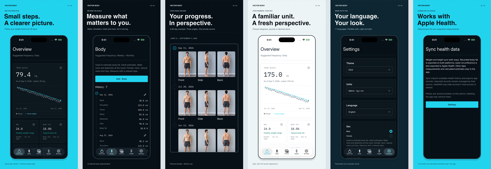

# VECTOR BODY — App Store kit

English (US), version 1.0.0. Prepared September 11, 2026.



## Deliverables

- [Listing source](listing.json): name, subtitle, promotional text, keywords, description and category. Paste-ready text files are in `metadata/en-US`.
- [Six full-size screenshots](screenshots/iphone-6.9): numbered upload order, 1320 × 2868, opaque RGB PNG.
- [Contact sheet](screenshots/contact-sheet.png): review preview only; do not upload it as a screenshot.
- [App icon](app-icon-1024.png): copy of the existing app icon, not a new design.
- [App Review notes](review-notes.md).
- [Privacy policy draft](privacy-policy-draft.md) and [support-page draft](support-page-draft.md): complete the owner/contact fields and publish at HTTPS URLs.
- [Submission checklist](submission-checklist.md): remaining App Store Connect details and release checks.
- [Validation results](validation.json): metadata character counts and screenshot formats.

## Progress photos included

The third screenshot shows the real Photos gallery populated with the nine user-supplied images in `photos/day0`, `photos/day45` and `photos/day90` (front, side and back PNGs in each). Dates are June 13, July 28 and September 11, 2026: exactly 90 elapsed days. The panel uses a framed crop of the actual scrolled gallery so all three dates and progress images are prominent; it does not represent a new comparison screen. The footer states “Fictional example · Results vary”.

The supplied photos are used unchanged. Their generation model and exact generation prompts were not provided; `photos/prompts.md` retains the original production brief, not a verified generation log. The seed script imports all nine images into a fresh simulator. Raw captures include the gallery's initial and scrolled positions.

## Upload format

Upload only the six numbered PNGs in `screenshots/iphone-6.9`, in filename order. Every file is **1320 × 2868 pixels, portrait, 8-bit sRGB RGB, with no alpha channel**. This matches one of the specified accepted sizes: 1260 × 2736, 2736 × 1260, 1320 × 2868, 2868 × 1320, 1290 × 2796, or 2796 × 1290. The renderer validates dimensions, PNG format, RGB color space, three channels and absence of transparency; it also rejects unexpected files in the upload folder. The contact sheet and raw captures are working materials, not upload files. Matching the technical format does not guarantee App Review approval.

## Rebuild the marketing assets

From the repository root, with Node 24 and installed project dependencies:

```sh
node docs/app-store/scripts/build-assets.mjs
```

The script checks metadata limits, generates the individual text fields, uses the bundled Inter font, composes the actual captures with editorial headlines, validates opaque PNG dimensions, and regenerates the contact sheet. Edit copy, colors and order in `scripts/build-assets.mjs`; edit store metadata in `listing.json`.

## Capture provenance and demo data

Raw images were captured using `xcrun simctl io … screenshot` on an isolated iPhone 17 Pro Max simulator running iOS 26.5. The existing local `com.bodytrack.app` development binary loaded this repository's JavaScript through Metro. Its native container has an older identity; verify final screenshots against the distribution build using `dev.svindland.vector.body` before submitting.

Capture simulator: `VECTOR BODY Store Capture`, UUID `062FADFB-93CC-4089-9E8D-476635732E09`. Health sync was kept off. No existing simulator data was overwritten. A temporary launch redirect selected the native screens; a temporary initial scroll offset positioned the Photos gallery. Both were removed afterward. No production app files or app.json changes are part of this kit.

The sample spans June 13–September 11, 2026: 91 daily entries over 90 elapsed days, seven body sessions, height 182 cm. Daily weight moves from 84.0 to 79.1 kg with fluctuations; the final smoothed trend is 79.4 kg. Measured body fat moves from 22% to 18%. These are fictional records, not an efficacy claim. The app calculates the values shown in the captures.

For a new capture, create an isolated simulator, install the app, launch once for database migrations, then stop it. Obtain its data container with `xcrun simctl get_app_container <device> <bundle-id> data`, then run:

```sh
python3 docs/app-store/scripts/seed-demo.py /absolute/simulator/app/data/container
```

The seed script refuses a populated database. Open each screen using the simulator UI, normalize the status bar to 9:41, and capture to `screenshots/raw/`. Capture Overview in dark/metric and light/imperial; Body, Photos, Settings and the health explanation in dark/metric. Scroll Photos until all three dated sessions are visible. Native system prompts, developer overlays and incomplete rendering must be dismissed before capture. The health explanation is the existing `/health-privacy` route.

All panels contain actual screens scaled into a neutral rounded presentation frame. The photo panel crops to the gallery content; its date-range caption is editorial text outside the app. Headlines are editorial overlays outside the app. The set does not add buttons, controls or in-app charts that do not exist. The current Photos implementation has a gallery and individual preview, not side-by-side comparison, despite the older README feature list.
